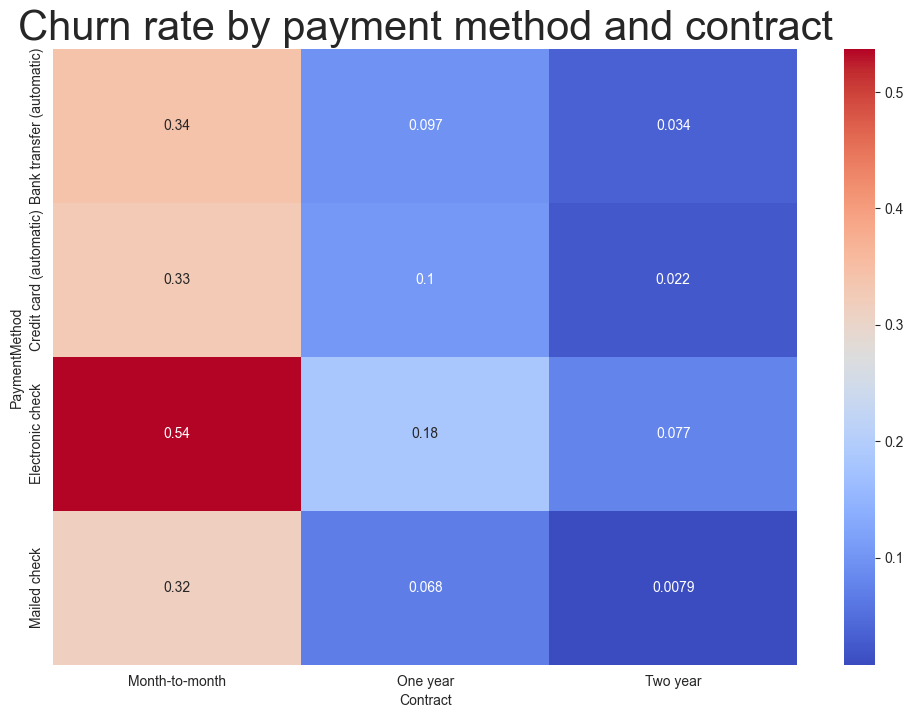

# Telco Customer Churn analysis and insights

## Introduction

Analysis and insights are based on the data written in the logs: costumer_churn_log.txt

## Overview

The data set displays information about each customer, including customer ID, personal information, services, and billing. There is a total of 7043 entries with distinct costumers (based on their unique ID). Most of the features are yes/no answers, in other words boolean features

## Exploritary Data Analysis

- In total, 27% of costumers in the dataset have churned
- There is a total of 9 services to subsrcibe to. A majority of the costumers subscribe to the phone service (90%), followed by the internet service (78%). For the rest of the services, the share of costumer who subscribe are <50%.
- Each costumer pays \$64.75 per month on average, and \$70.35 median. The minimum monthly payment is \$18.25, which presumably is the price of the basis service. The maximum monthly payment is \$118.750, which is most likely the price for all the services combined.
- The average tenure is 32.4 months for all costumers, but with at large spread of 24.6 months. The average tenure of non-churned costumers are 37.6 months, compared to 18.0 months for churned costumers. Suggesting that long tenure costumers are more loyal. Most (47%) of costumers churn within the first year. 

- The average costumer subsrcibe to 4.14 services.
- Churn rate by contract. Customers with a month-to-month-contract have a much higher chance to churn than customers with a one-year-contract (11.3 %) or a one-year-contract (2.8%)
- Electronic check have a higher churn rate than the other methods (45%, compared to 15-20% for automatic bank and credit card transfer, and mailed check)
- High-paying customers have almost twice the churn rate as low-paying costumers (35% vs. 18%).
- 42.7% of customers with a month-to-month contract have churned, compared to 11.2% for customers with a one year-contract and 2.8% for customers with a two year-contract

## Model Performance

### Logistic Regression

- Accuracy: 81%
- Precision: 67%
- Recall: 55%
- F1 Score: 0.60
- Cross-validation mean score: 0.793

Key predictive features:
1. Tenure (1.860)
1. Monthly Charges (1.057)
1. Contract (0.852)
1. Tenure Bucket (0.598)
1. Number of Services (0.448)

### XGBoost

- Accuracy: 80%
- Precision: 66%
- Recall: 54%
- F1 Score: 0.60
- Cross-validation mean score: 0.790

Key predictive features:

1. Contract (0.699)
1. Payment Method - Electronic check (0.073)
1. Tenure (0.052)
1. Monthly Charges (0.049)
1. Payment Method - Mailed check (0.042)

### Random Forest

- Accuracy: 77%
- Precision: 59%
- Recall: 47%
- F1 Score: 0.53
- Cross-validation mean score: 0.765

Key predictive features:

1. Monthly Charges (0.456)
1. Tenure (0.241)
1. Contract (0.103)
1. Number of Services (0.081)
1. Tenure Bucket (0.056)

### Correlations

- Models consistenly show that tenure, monthly charges, contract type, and number of services are important features for churn rate 

## Recommendations

1. Contracts
    - Prioritize converting month-to-month customers to long-term contracts
    - Consider incentives for long-term commitments

1. Payment Methods
    - Investigate why electronic check users churn more frequently, and encourage automatic payment methods
    - Consider incentives for bank transfer or credit card payments

1. Tenure
    - Focus retention efforts on customers within their first year
    - Develop specific programs for high-paying customers showing churn risk

1. Services
    - Create attractive service bundles to increase service adoption
    - Target optimal service combination based on churn analysis

1. Price
    - Consider giving discounts for high-paying customers, or a better package deal. 
    - Consider giving discounts based on tenure